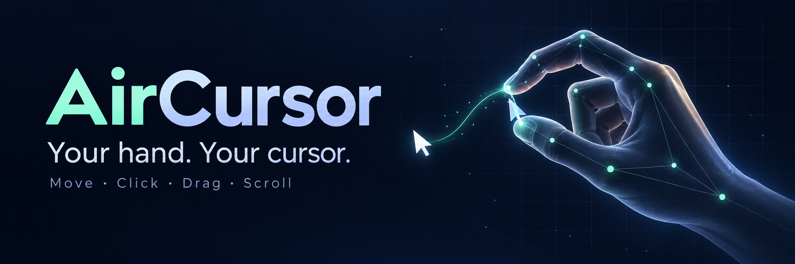
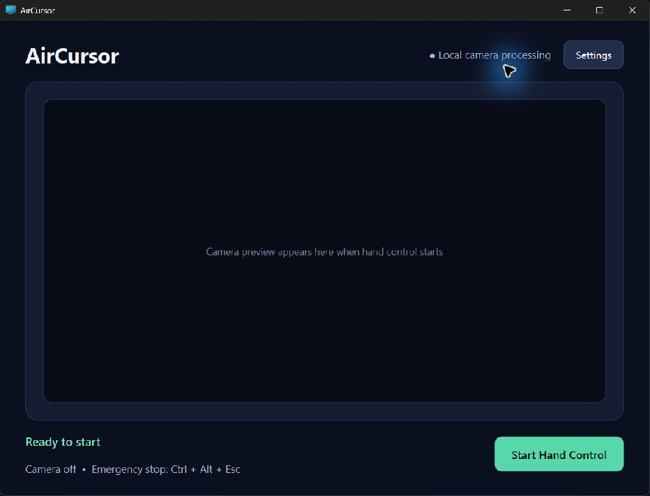
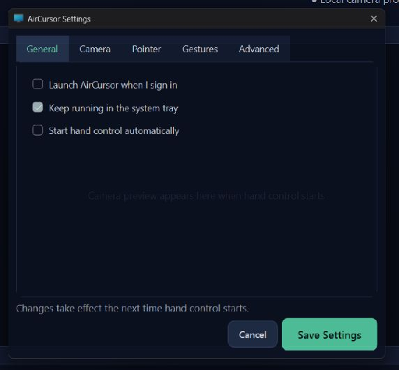
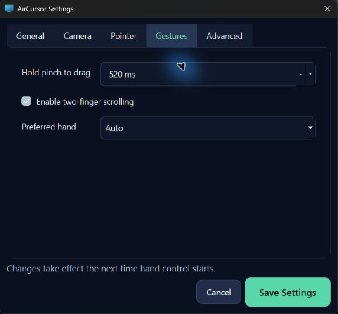

# AirCursor

AirCursor turns a webcam and one hand into a touchless mouse for Windows. It uses MediaPipe landmarks locally to move the pointer, click, drag, and scroll without recording or uploading video.

## Why this repository exists

This repository contains the reusable, auditable core of the AirCursor desktop project: landmark models, hand selection, coordinate mapping, adaptive smoothing, gesture state machines, Windows input, safety controls, and a runnable webcam demo. The 673 MB packaged application and its copied third-party runtime are intentionally excluded.

## Features

- Local-only webcam processing
- Stable left-, right-, or automatic-hand selection
- Pointer movement from the thumb/index midpoint
- Pinch and release to click
- Hold a pinch to drag
- Two-finger vertical movement to scroll
- One Euro adaptive filtering for smooth but responsive motion
- Reduced camera control area mapped across the full display
- Automatic mouse-button release after tracking loss or failure
- `Ctrl+Alt+Esc` emergency stop and `Q` to quit the preview
- Framework-neutral core components with automated tests

## Quick start

AirCursor supports Windows 10/11 with Python 3.11 or 3.12 and a webcam.

```powershell
git clone https://github.com/FarzamFattahi/aircursor.git
cd aircursor
python -m venv .venv
.venv\Scripts\Activate.ps1
python -m pip install -e .
aircursor
```

Keep your hand inside the green rectangle. Move using the midpoint between your index fingertip and thumb tip. Pinch and release to click, hold the pinch to drag, or extend only the index and middle fingers to scroll.

## Controls

| Action | Gesture or key |
|---|---|
| Move pointer | Move thumb/index midpoint |
| Click | Pinch, then release |
| Drag | Hold pinch for 520 ms |
| Scroll | Extend index and middle fingers; move vertically |
| Stop safely | `Ctrl+Alt+Esc` |
| Close preview | `Q` |

## Application views

| Main window | General settings |
|---|---|
|  |  |



The screenshots show the original packaged Windows interface. The repository focuses on the reusable computer-vision and interaction engine and includes a lightweight OpenCV demo rather than the proprietary build bundle.

## Architecture

```text
Webcam frame
    |
    v
MediaPipeHandDetector -> HandSelector -> GestureManager
                                           |
                     +---------------------+--------------------+
                     |                     |                    |
               PinchDetector        DragController       ScrollDetector
                     |
                     v
CoordinateMapper -> OneEuroFilter -> PointerGain -> TapStabilizer
                     |
                     v
              WindowsInputController
```

The vision layer produces small framework-neutral dataclasses. Gesture logic and pointer transforms have no OpenCV or MediaPipe dependency, which makes them reusable and easy to test. Platform input is isolated behind an abstract interface.

## Use components independently

```python
from aircursor.pointer import CoordinateMapper, OneEuroFilter

mapper = CoordinateMapper(screen_width=1920, screen_height=1080)
smoother = OneEuroFilter()

screen_point = mapper.map(0.42, 0.36)
stable_point = smoother.filter(screen_point, timestamp=1.25)
```

```python
from aircursor.gestures import DragAction, DragController

drag = DragController(hold_seconds=0.52)
drag.pinch_started(now=10.0)
assert drag.tick(now=10.6) is DragAction.BUTTON_DOWN
assert drag.pinch_released(now=10.8) is DragAction.BUTTON_UP
```

## Development

```powershell
python -m pip install -e ".[dev]"
pytest
ruff check .
```

Automated tests cover deterministic gesture, mapping, filtering, and safety behavior. Physical-webcam testing is still required for lighting, camera placement, and real desktop interaction.

## Privacy and safety

Frames remain in memory and are never saved or transmitted by the application. The app does move and click the system pointer, so start with an uncluttered desktop and keep `Ctrl+Alt+Esc` available. Tracking loss and shutdown always request a mouse-button release.

## License

MIT. See [LICENSE](LICENSE).
